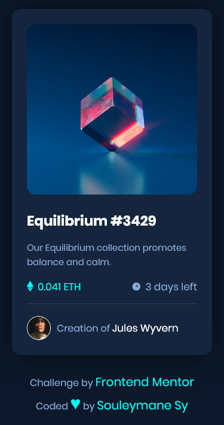
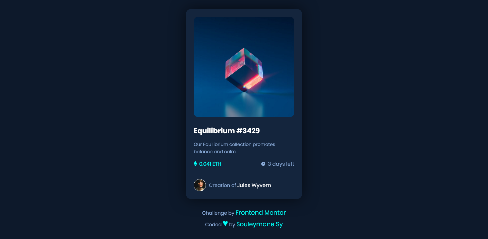

# Frontend Mentor - NFT preview card component

## Welcome! 👋

Thanks for checking out this front-end coding challenge.

This is a solution to the [NFT preview card component challenge on Frontend Mentor](https://www.frontendmentor.io/challenges/nft-preview-card-component-SbdUL_w0U).

[Frontend Mentor](https://www.frontendmentor.io) challenges help you improve your coding skills by building realistic projects.

## Table of contents

- [The challenge](#the-challenge)
- [Links](#links)
- [Screenshot](#screenshot)
- [Author](#author)

### The challenge

Users should be able to:

- View the optimal layout depending on their device's screen size
- See hover states for interactive elements

### Screenshot

This is the Screenshot of the projects a made!

### Mobile

### Mobile Hover

### Desktop

### Built with

- Semantic HTML5 markup
- CSS custom properties
- Flexbox
- Mobile-first workflow

### Links

There is the link of the projects:

- Solution URL: [solution URL here](https://www.frontendmentor.io/solutions/nft-preview-card-component-OTqo6JL-X4)
- Live Site URL: [live site URL here](https://fem-nft-preview-card-component-vert.vercel.app/)

## Author

- GitHub - [Souleymane Sy](https://github.com/SouleymaneSy7)
- Frontend Mentor - [@SouleymaneSy7](https://www.frontendmentor.io/profile/SouleymaneSy7)
- Twitter - [@Souleymanesy43](https://twitter.com/Souleymanesy43)
